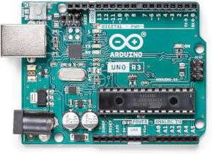
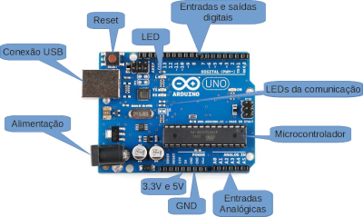
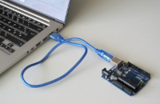
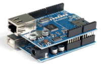

# Microcontroladores e Microprocessadores

## Aula 02

### Introdução ao Arduino
### Entradas e Saídas Digitais

Prof. M.Sc. [Diego Ascânio Santos](mailto:ascanio@cefetmg.br)

Aula baseada nas apostilas do Prof. Dr. [Ricardo Kerschbaumer — IFC, Campus Luzerna](https://lattes.cnpq.br/5304374284779760)

CEFET-MG DECOMDV — Divinópolis, 2024

---

## Objetivos

- Mostrar como funciona o Arduino e seus componentes principais;
- Apresentar o ATMEGA328P;
- Apresentar o ambiente de desenvolvimento do Arduino;
- Apresentar entradas e saídas digitais do Arduino;
- Apresentar os circuitos de conexão de componentes externos ao Arduino;

---

## Roteiro

1. Introdução ao Arduino;
    1. ATMega328P;
    2. Alimentação do Arduino;
    3. Entradas e saídas do Arduino;
    4. Ambiente de desenvolvimento do Arduino;
2. Entradas e saídas digitais;
    1. Entradas digitais no Arduino;
    2. Saídas digitais no Arduino;
        1. Conexão de relés;
        2. Conexão de um motor utilizando transistor;
        3. Conexão de lâmpada de sinalização;
        4. Conexão de pequenos motores;
        5. Conexão de motores de passo;
        6. Conexão de motores CC com reversão;
        7. Conexão de displays de LED;
        8. Circuitos especializados de saída;
3. Shields.

---

<!-- _class: lead -->
# Introdução ao Arduino

---

## Introdução ao Arduino

- Arduino é uma placa de prototipagem eletrônica de código aberto — *hardware* livre — que permite a criação de projetos interativos e autônomos.
    - Inicialmente baseado em microcontroladores AVR da Atmel, o arduino pode ser programado em C/C++.
    - Por ser *hardware* livre ele permite a construção de projetos **faça você mesmo** (DIY) de baixo custo, flexíveis e fáceis de se usar.
    - A quantidade de placas que compõem a família Arduino é muito extensa. Por isso, a disciplina se concentrará nas placas Arduino construídas em torno do microcontrolador ATMEGA328P / ATMEGA168P (Arduino Uno, Nano, Pro Mini, etc). Um Arduino UNO, principal expoente dos arduinos construídos em torno do ATMEGA328P, é mostrado na figura 1.

<figure>

<!-- _class: transparent -->

<figcaption>Figura 1 — Arduino UNO</figcaption>
</figure>

---

## Introdução ao Arduino

- O arduino é composto por um microcontrolador, entradas e saídas (digitais e analógicas) uma entrada de alimentação, uma interface serial ou USB para comunicação (e programação) com o computador, botão de Reset, LEDs de indicação, saídas de alimentação de periféricos em nível lógico TTL (+5V) e CMOS (+3.3V) e referências comuns (GND) como mostrado na Figura 2.

<figure>

<!-- _class: transparent -->

<figcaption style="text-align: center;">Figura 2 — Componentes de um Arduino</figcaption>
</figure>

---

## Introdução ao Arduino

- A programação do arduino é feita a partir de um computador conectado ao arduino pela porta USB, como mostrado na Figura 3.

- Um aspecto muito importante das placas arduinos é a capacidade de serem expandidas através de *shields* (escudos, tradução literal) que são placas que se encaixam na placa principal e adicionam funcionalidades como GPS, Bluetooth, Ethernet, entre outros. A Figura 4 mostra um Arduino com um shield de Ethernet que possibilita sua conexão à internet.

<figure>

<!-- _class: transparent -->

<figcaption style="text-align: center;">Figura 3 — Conexão do arduino a um computador</figcaption>
</figure>

<figure>

<!-- _class: transparent -->

<figcaption style="text-align: center;">

Figura 4 — Arduino extendido com um *shield* ethernet

</figcaption>
</figure>

