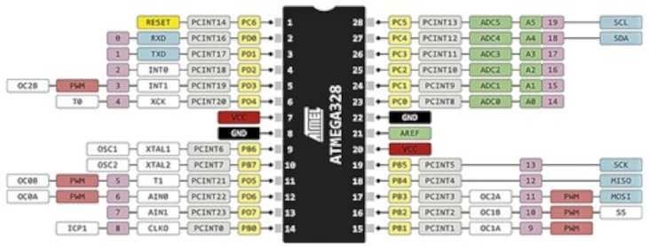
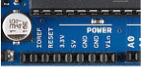
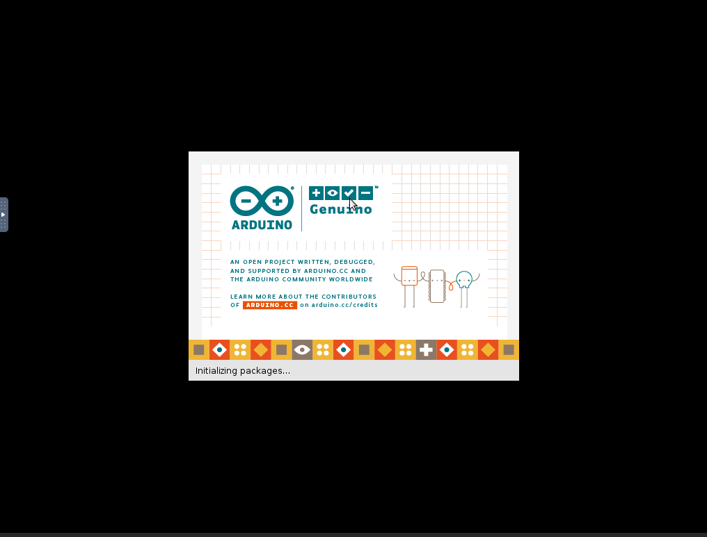
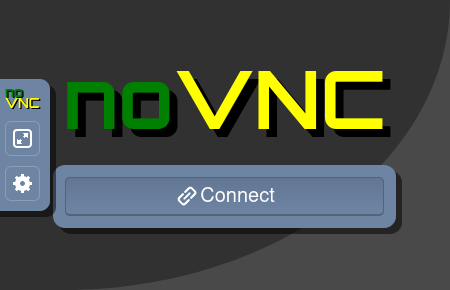

# Microcontroladores e Microprocessadores

## Aula 02

### Introdução ao Arduino
### Entradas e Saídas Digitais

Prof. M.Sc. [Diego Ascânio Santos](mailto:ascanio@cefetmg.br)

Aula baseada nas apostilas do Prof. Dr. [Ricardo Kerschbaumer — IFC, Campus Luzerna](https://lattes.cnpq.br/5304374284779760)

CEFET-MG DECOMDV — Divinópolis, 2024

---

## Objetivos

- Mostrar como funciona o Arduino e seus componentes principais;
- Apresentar o ATMEGA328P;
- Apresentar o ambiente de desenvolvimento do Arduino;
- Apresentar entradas e saídas digitais do Arduino;
- Apresentar os circuitos de conexão de componentes externos ao Arduino;

---

## Roteiro

1. Introdução ao Arduino;
    1. ATMega328P;
    2. Alimentação do Arduino;
    3. Entradas e saídas do Arduino;
    4. Ambiente de desenvolvimento do Arduino;
2. Entradas e saídas digitais;
    1. Entradas digitais no Arduino;
    2. Saídas digitais no Arduino;
        1. Conexão de relés;
        2. Conexão de um motor utilizando transistor;
        3. Conexão de lâmpada de sinalização;
        4. Conexão de pequenos motores;
        5. Conexão de motores de passo;
        6. Conexão de motores CC com reversão;
        7. Conexão de displays de LED;
        8. Circuitos especializados de saída;
3. Shields.

---

<!-- _class: lead -->
# Introdução ao Arduino

---

## Introdução ao Arduino

- Arduino é uma placa de prototipagem eletrônica de código aberto — *hardware* livre — que permite a criação de projetos interativos e autônomos.
    - Inicialmente baseado em microcontroladores AVR da Atmel, o arduino pode ser programado em C/C++.
    - Por ser *hardware* livre ele permite a construção de projetos **faça você mesmo** (DIY) de baixo custo, flexíveis e fáceis de se usar.
    - A quantidade de placas que compõem a família Arduino é muito extensa. Por isso, a disciplina se concentrará nas placas Arduino construídas em torno do microcontrolador ATMEGA328P / ATMEGA168P (Arduino Uno, Nano, Pro Mini, etc). Um Arduino UNO, principal expoente dos arduinos construídos em torno do ATMEGA328P, é mostrado na figura 1.

<figure>

<!-- _class: transparent -->

<figcaption>Figura 1 — Arduino UNO</figcaption>
</figure>

---

## Introdução ao Arduino

- O arduino é composto por um microcontrolador, entradas e saídas (digitais e analógicas) uma entrada de alimentação, uma interface serial ou USB para comunicação (e programação) com o computador, botão de Reset, LEDs de indicação, saídas de alimentação de periféricos em nível lógico TTL (+5V) e CMOS (+3.3V) e referências comuns (GND) como mostrado na Figura 2.

<figure>

<!-- _class: transparent -->

<figcaption style="text-align: center;">Figura 2 — Componentes de um Arduino</figcaption>
</figure>

---

## Introdução ao Arduino

- A programação do arduino é feita a partir de um computador conectado ao arduino pela porta USB, como mostrado na Figura 3.

- Um aspecto muito importante das placas Arduino é a capacidade de serem expandidas através de *shields* (escudos, tradução literal) que são placas que se encaixam na placa principal e adicionam funcionalidades como GPS, Bluetooth, Ethernet, entre outros. A Figura 4 mostra um Arduino com um shield Ethernet que possibilita sua conexão à internet.

<figure>

<!-- _class: transparent -->

<figcaption style="text-align: center;">Figura 3 — Conexão do arduino a um computador</figcaption>
</figure>

<figure>

<!-- _class: transparent -->

<figcaption style="text-align: center;">

Figura 4 — Arduino extendido com um *shield* Ethernet

</figcaption>
</figure>

---

## Introdução ao Arduino — Microcontrolador ATmega328P

- De todos os componentes do Arduino, o mais importante é o microcontrolador.
    - Ele é o cérebro do Arduino e é responsável por todas as operações.
- Como dito anteriormente, existem vários modelos de Arduino, cada qual com um microcontrolador específico.
    - Os adotados neste curso são os microcontroladores ATmega168 e ATmega328P, presente no Arduino UNO.
    - A pinagem do microcontrolador ATmega328P é mostrada pela Figura 5, enquanto as características do microcontrolador são apresentadas a seguir:

<!-- _class: lead -->
### Principais características do ATmega328P

- CPU RISC de 8 bits;
- Capacidade de processamento de 20 milhões de instruções por segundo (MIPS) em 20 MHz;
- Memória Flash de programa de 32 KB;
- Memória SRAM de 2 KB;
- Memória EEPROM de 1 KB;
- Programável no circuito;
- 2 temporizadores/contadores de 8 bits;

- 1 temporizador/contador de 16 bits;
- 6 entradas analógicas (ADC) de 10 bits;
- Contador de tempo real (RTC);
- 23 pinos de entrada/saída digitais;
- 6 canais PWM;
- Comunicação UART, SPI e I2C;
- Operação em 1,8 V a 5,5 V.

---

## Introdução ao Arduino — Microcontrolador ATmega328P

<figure>

<!-- _class: transparent -->

<figcaption class="regular" style="text-align: center;">Figura 5 — Pinagem do microcontrolador ATmega328P</figcaption>
</figure>

---

## Introdução ao Arduino — Alimentação

- O arduino pode receber alimentação de duas formas: USB ou por uma fonte externa como ilustrado pela Figura 6.
- Quando a alimentação é realizada por fonte externa, a tensão de alimentação deve ser de 7 a 12V.
    - Reguladores de tensão internos do Arduino reduzem a tensão para os níveis lógicos necessários aos componentes (TTL ou CMOS).
    - *Hoaxes* dizem que o Arduino aguenta até 20V, mas, não é bom pagar para ver.
- O consumo total de corrente no Arduino não deve ultrapassar \\(500mA\\).
- A comutação entre alimentação USB e externa é feita automaticamente pelo Arduino.

<figure>

<!-- _class: transparent -->

<figcaption style="text-align: center;">Figura 6 — Alimentação do Arduino.</figcaption>
</figure>

---

## Introdução ao Arduino — Alimentação

- O Arduino também fornece conexões de alimentação para periféricos ou *shields* conectados a ele.
    - A Figura 7 mostra a disposição destes conectores de alimentação no Arduino Uno.
- Nestes conectores, o pino `IOREF` fornece uma tensão de referência para os *shields* e periféricos conectados ao Arduino.
    - Assim, o *shield* ou periférico pode reconhecer se o nível lógico de tensão é CMOS (3.3V) ou TTL (5V).
- O pino `RESET` é conectado ao botão de reset do Arduino e permite que periféricos ou *shields* conectados ao Arduino possam reiniciar o microcontrolador.
- O pino `3.3V` fornece uma tensão de 3.3V para alimentar periféricos ou *shields* que operam em CMOS.
- O pino `5V` fornece uma tensão de 5V para alimentar periféricos ou *shields* que operam em TTL.

- Os pinos `GND` são conectados ao terra do Arduino e fornecem uma referência de tensão para os periféricos ou *shields* conectados.
- O pino `VIN` permite alimentar o Arduino através de algum circuito externo, sem a nacessiade de utilizar a porta USB ou a fonte de alimentação do Arduino.
    - Este pino também é conectado ao regulador de tensão do Arduino.
    - Os níveis operacionais de tensão permanecem entre 7V e 12V.

<figure>

<!-- _class: transparent -->

<figcaption style="text-align: center;">

Figura 7 - Conectores de alimentação de *shields* e periféricos do Arduino Uno.

</figcaption>
</figure>

---

## Introdução ao Arduino — Entradas e Saídas

- Como visto nos conteúdos anteriores, o arduino possui entradas e saídas dos tipos digitais e analógicas.
    - Em relação aos tipos digitais são 14 pinos que podem enviar ou receber sinais digitais de nível lógico TTL (0V e 5V), ou seja, 0 ou 1.
        - Alguns destes pinos digitais também podem ser utilizados em outras funções:
            - 6 pinos (pinos 3, 5, 6, 9, 10 e 11) podem ser utilizados como saídas PWM (Pulse Width Modulation), que com devidas adaptações, simula saídas analógicas, como veremos mais adiante.
            - Os pinos 0 e 1 podem ser utilizados para comunicação serial (RX e TX).
            - Os pinos 2 e 3 podem ser utilizados para interrupções externas.
    - Já os pinos analógicos do Arduino (A0 - A5, que correspondem respectivamente aos pinos 14 - 19) só podem ser utilizados como entradas analógicas.
        - As entradas analógicas são implementadas no arduino através de um conversor analógico-digital (ADC) compartilhado entre elas, que converte uma tensão analógica (entre 0 a 5V) em um valor digital de 10 bits (0 a 1023) para cada entrada.
        - Como apenas um único ADC está disponível para todas as entradas analógicas, apenas uma entrada analógica pode ser lida por vez.
- A Figura 8 ilustra as entradas e saídas do Arduino UNO com suas principais funções.

---

## Introdução ao Arduino — Entradas e Saídas

<figure>

<!-- _class: transparent -->

<figcaption class="regular" style="text-align: center;">
Figura 8 — Entradas e saídas do Arduino UNO com suas principais funções.
</figcaption>
</figure>

---

## Introdução ao Arduino — Ambiente de Desenvolvimento

- Para se programar o Arduino são necessárias ferramentas de desenvolvimento apropriadas para tal.
    - Existem diversas formas de se programar o Arduino, tais quais:
        1. Plugins para configuração no VSCode;
        2. Interfaces de linha de comando para compilação e upload de código;
        3. O ambiente de desenvolvimento integrado oficial do Arduino, o Arduino IDE, ilustrado pelas Figuras 10 e 11.

<figure style="padding: 10px;">

<figcaption style="text-align: center;">Figura 10 — Tela de Carregamento do Arduino IDE</figcaption>
</figure>

<figure style="padding: 10px;">

<figcaption style="text-align: center;">Figura 11 — Arduino IDE carregado em sua tela inicial</figcaption>
</figure>

---

## Introdução ao Arduino — Ambiente de Desenvolvimento

- É recomendado na disciplina utilizar a IDE oficial do Arduino para a programação dos microcontroladores — Apenas UPLOAD dos códigos. Esta IDE está disponível no container de aulas do professor da disciplina. 
    - Utilizar este container permite garantir que todos os alunos estão utilizando a mesma versão do ambiente de desenvolvimento, evitando problemas de compatibilidade entre diferentes versões do software e portanto, garantindo a reprodutibilidade dos experimentos.
        - As instruções apropriadas para execução deste container estão disponíveis em seu [repositório](https://github.com/diegoascanio/container-aulas-cefetmg).
    - Caso o aluno deseje apenas instalar a IDE do Arduino em seu computador, acesse o [site oficial](https://www.arduino.cc/en/software) e siga as instruções de instalação para o seu sistema operacional.
    - Também é facultado ao aluno utilizar outras ferramentas de sua preferência, entretanto, não é garantido nenhum suporte para problemas de compatibilidade que possam surgir.

---

## Introdução ao Arduino — Ambiente de Desenvolvimento

- A IDE oficial do Arduino dispõe de um editor de texto, um compilador, um gravador de firmware, monitor serial, gerenciador de bibliotecas, ferramentas de depuração, exemplos de código e muitos outros recursos.
- O upload do firmware para a placa é feito através de um cabo USB, que também é usado para alimentar a placa. Além disso, pelo mesmo cabo é possível monitorar o funcionamento da placa através de comunicação serial, bem como, construir gráficos de dados numéricos enviados pela placa em tempo real.
- A Figura 12 mostra um código de exemplo carregado no Arduino IDE que faz a placa enviar sequencialmente e em loop, todos os caracteres da tabela ASCII pela comunicação serial.

<figure>

<!-- _class: transparent -->

<figcaption style="text-align: center;">Figura 12 - Arduino IDE com o programa ASCIITable</figcaption>
</figure>

---

## Introdução ao Arduino — Uso da IDE
### Pré requisitos

1. No linux, além de ter a IDE do Arduino instalada, é necessário adicionar o usuário ao grupo `dialout` e / ou `tty` (a depender da distro) para que o usuário tenha permissão de acesso à porta serial. Para isso, execute o comando `sudo usermod -a -G [GRUPO] $USER` e faça logout e login novamente, onde `[GRUPO]` é o nome do respectivo grupo (`tty` ou `dialout`) que permite o acesso à porta serial na sua distro.

2. Feito isso, conecte o Arduino UNO à porta USB do computador e verifique se o sistema reconheceu a placa. Para isso, execute o comando `dmesg | grep tty` e verifique se a placa foi reconhecida. Se sim, a saída do comando será algo como `/dev/ttyACM0` ou `/dev/ttyUSB0`.

3. Se utilizar o container da disciplina — o que torna dispensável a instalação do Arduino IDE em seu Host — adicione também seu usuário ao grupo `docker` para que o usuário tenha permissão de acesso à porta serial. Para isso, execute o comando `sudo usermod -a -G docker $USER` e faça logout e login novamente.

4. Inicie o container da disciplina com o comando `docker run -it --rm -p 6080:6080 -v ~/container-aulas-cefetmg:/container-aulas-cefetmg --ulimit nofile=65536:65536 --device /dev/ttyUSB0:/dev/ttyUSB0 diegoascanio/cefetmg:container-aulas`. Se a placa estiver identificada como `/dev/ttyACM0`, substitua as ocorrências de `/dev/ttyUSB0` por `/dev/ttyACM0` no comando.

---

## Introdução ao Arduino — Uso da IDE
### Pré requisitos

5. Iniciado o container da disciplina, abra o endereço [http://localhost:6080](http://localhost:6080) no navegador de sua preferência para acessar a interface gráfica do container e clique em `Connect` como mostra a Figura 13.
6. Em seguida, clique com o botão direito do mouse em qualquer parte da tela preta para abrir o menu de aplicativos do container. Em seguida, navegue até `Development` e clique em `Arduino IDE` para abrir a IDE do Arduino, como mostra a Figura 14.

<figure>

<figcaption class="footnotesize" style="text-align: center;">Figura 13 — Tela Inicial do Container</figcaption>
</figure>
<figure>

<!-- _class: transparent -->

<figcaption class="footnotesize" style="text-align: center;">Figura 14 — Acesso ao Arduino IDE</figcaption>
</figure>

---

## Introdução ao Arduino — Uso da IDE
### Pré requisitos

7. Se você estiver usando o Arduino UNO, pode passar diretamente ao passo 8. Se for o Arduino nano ATmega168 (Arduino nano vermelho) siga os passos a seguir:
    1. No Arduino IDE clique em `Tools`, depois em `Board` e selecione `Arduino Nano`, como mostra a Figura 15.
    2. Em seguida, clique novamente em `Tools`, depois em `Processor` e selecione `ATmega168`, como mostra a Figura 16.

<figure>

<!-- _class: transparent -->

<figcaption style="text-align: center;">Figura 15 - Seleção do Arduino Nano</figcaption>
</figure>
<figure>

<!-- _class: transparent -->

<figcaption style="text-align: center;">Figura 16 - Seleção do Processador ATmega168</figcaption>
</figure>

